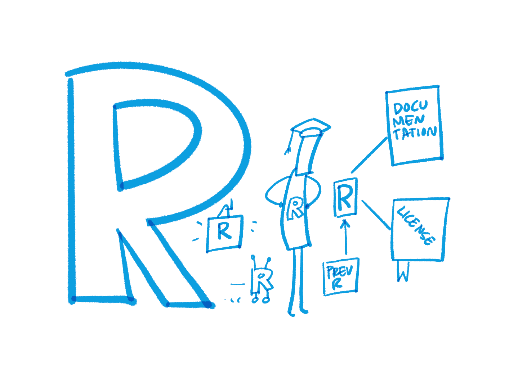

## 2.2 What is FAIR?

In 2016, the **&#39;[FAIR Guiding Principles for scientific data management and stewardship](http://www.nature.com/articles/sdata201618)&#39;** were published in Scientific Data (Wilkinson et al. 2016). FAIR stands for findable, accessible, interoperable and reusable. The FAIR principles have become increasingly important, acting as guidelines to improve the entire lifecycle of research data management.

While FAIR and open data are overlapping yet distinct concepts, they both focus on data sharing to ensure that data are made available in ways that promote access and reuse (Higman et al. 2019). Open Research promotes a cultural shift towards sharing research outputs, whereas FAIR concentrates on how to prepare data so that they can be reused by others. However, FAIR does not require data to be open, and following FAIR can be beneficial for data that cannot be made open, e.g. for privacy reasons. FAIR provides a set of rules that are a robust standard to which curation of data should aspire. Consequently, it should be noted that FAIR-compliant data are not necessarily of high quality, and the issue of quality assurance of the data is a separate one extending beyond the scope of this book. Similarly, it should be noted that FAIR-compliant data may be necessary but not sufficient in some reuse scenarios, e.g. computational reproducibility (see Peer et al. 2021).

The term \'FAIR' was originally launched at a Lorentz workshop in the Netherlands in 2014 (Wilkinson et al. 2016; Data FAIRport n.d.), and in the following we will refer to the FAIR Guiding Principles as they were published in 2016 (1: see below).

The FAIR principles are typically translated into concrete complementary actions to be taken by researchers, infrastructure providers, research funders and other actors (European Commission 2018; Science Europe 2021). They are increasingly becoming a requirement by national and European funders, and institutional policies on good research practice, e.g. German Research Foundation 2019, UK Research and Innovation, National Institutes of Health, Dutch Research Council, all of which provide guidance on what they expect researchers to implement during the course of their projects, such as DMP templates or checklists to identify FAIR-compliant repositories (Davidson et al. 2019; Sveinsdottir et al. 2021).

| | |
| --- | --- |
|  | **To be Findable:**  **F1.** (meta)data are assigned a globally unique and persistent identifier  **F2.** data are described with rich metadata (defined by R1 below)  **F3.** metadata clearly and explicitly include the identifier of the data it describes  **F4.** (meta)data are registered or indexed in a searchable resource |
| **To be Accessible:**  **A1.** (meta)data are retrievable by their identifier using a standardized communications protocol  **A1.1.** the protocol is open, free, and universally implementable  **A1.2.** the protocol allows for an authentication and authorization procedure, where necessary  A2. metadata are accessible, even when the data are no longer available |  |
|  | **To be Interoperable:**  **I1.** (meta)data use a formal, accessible, shared and broadly applicable language for knowledge representation.  **I2.** (meta)data use vocabularies that follow FAIR principles  **I3.** (meta)data include qualified references to other (meta)data |
| **To be Reusable:**  **R1.** meta(data) are richly described with a plurality of accurate and relevant attributes  **R1.1.** (meta)data are released with a clear and accessible data usage license  **R1.2.** (meta)data are associated with detailed provenance  **R1.3.** (meta)data meet domain-relevant community standards |  |

----

**(1)** We quote the FAIR Guiding Principles as they appear in Wilkinson et al. (2016). Therefore, the spelling deviates in some places from the standard British English used in this document.
