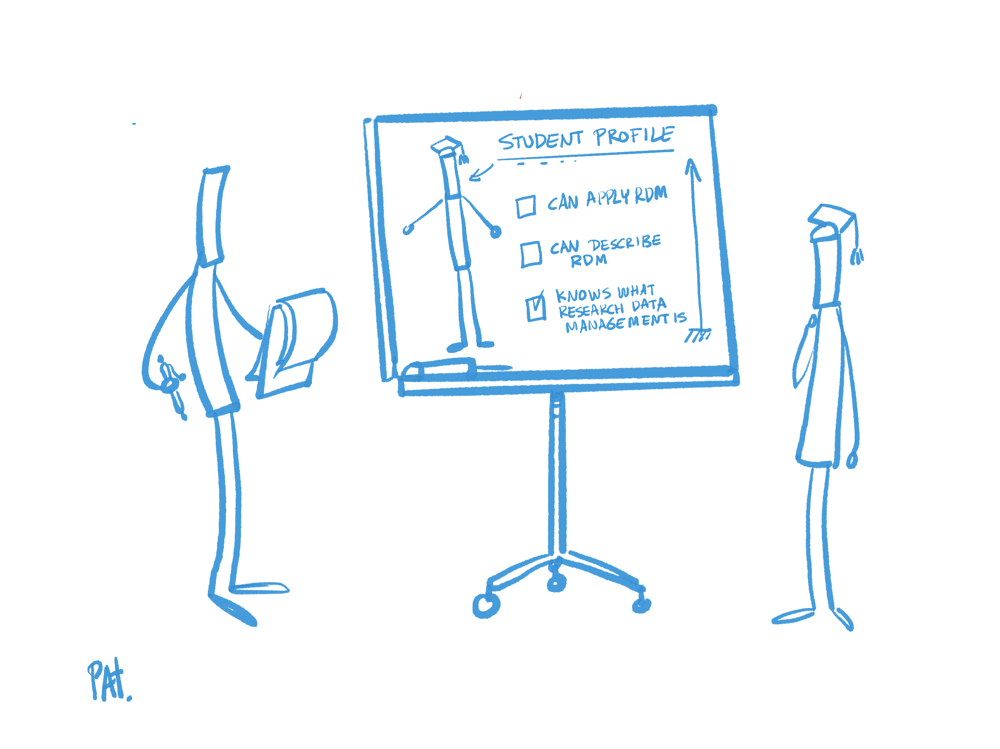

# 3 – FAIR skills and competences

Before actually implementing topics surrounding FAIR in curricula and teaching, the first thing to do is to define the knowledge and competences which students at different educational levels should acquire. Here, we suggest a separate core set of Knowledge Units and associated learning outcomes for the bachelor&#39;s, master&#39;s and PhD degree levels (2).
 These sets are discipline-agnostic and may need to be adapted slightly depending on the discipline in question. They can be used as a basis to develop a curriculum focused on the FAIR principles, or to map them to existing curricula and courses to identify which topics are already covered and which are not (and should therefore be added).

The competence profiles suggested here were developed based on the FAIR Competence Framework for Higher Education – Data Stewardship Professional Framework (Demchenko et al. 2021) and the corresponding (draft) Body of Knowledge (3) created by the FAIRsFAIR project (which are both heavily based on the EDISON Data Science Framework, EDISONcommunity 2020). They are summarised below (section [3.1](1FAIRsFAIRCompetenceFrameworkAndBoKforHE.md)) and followed by a description of the approach used to create the competence profiles and the learning outcomes (sections [3.2](2_1Method.md) and [3.3](3LearningOutcomes.md)).

---

**(2)** Initially, we had considered six roles in total. In addition to bachelor&#39;s, master&#39;s and PhD degree students, we also looked at postdoc/researcher, PI and support staff. However, due to capacity limitations, the latter three were dropped in favour of the target audiences most relevant for HEI teaching.

**(3)** In this draft version, one of four areas of the original version from the EDISON project (EDISONcommunity, 2020) – Research Data Management – has been updated and further developed. This is the domain most relevant to FAIR-related competences in university teaching. The other domains (Data Science Engineering, Data Science Research Methods and Project Management, as well as Data Science Domain Knowledge as Business Process Management) remain the same as in the original version.  
The (draft) Body of Knowledge is available in the Deliverable published in Zenodo at [https://zenodo.org/record/5905866](https://zenodo.org/record/5905866) (see page 86).
