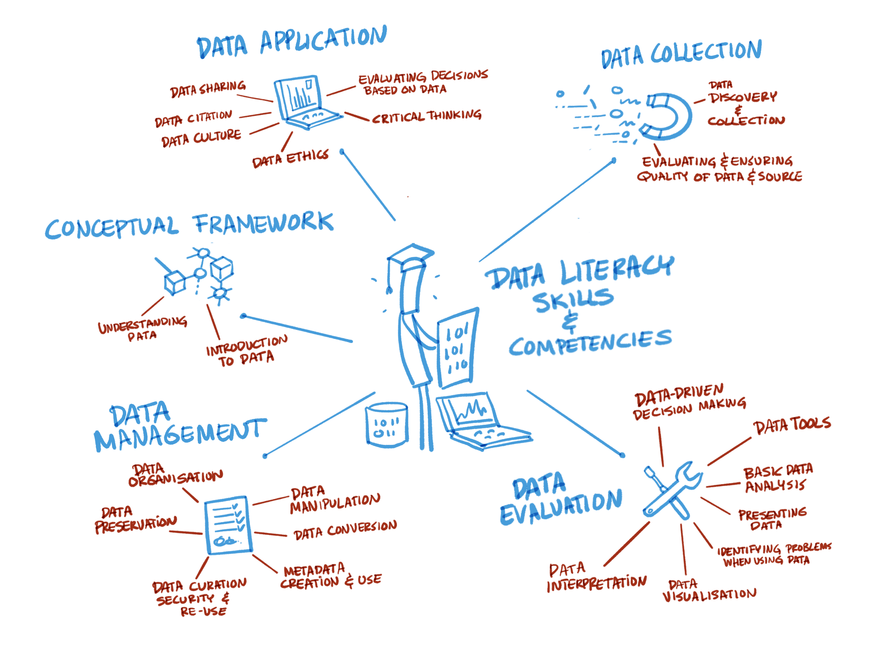

# 4 – Teaching and training designs for FAIR

## 4.1 Introduction

FAIR has attracted considerable interest in higher education and research circles. Teaching FAIR can be positioned in the broader discussion about advancing data literacy (see figure 1 below; for more detail on information literacy for higher education, see ACRL 2015). Moreover, teaching FAIR is increasingly important since the [FAIRsFAIR D7.1 survey](https://doi.org/10.5281/zenodo.3629682) (Stoy et al. 2020) has shown that courses on data handling (i.e. data analysis and/or scientific programming) rarely cover core FAIR topics like metadata standards, persistent identifiers and provenance.

_Figure 1: Schematic representation of data literacy skills and competencies by Patrick Hochstenbach, based on Guler (2019, p. 15), originally adapted from Ridsdale et al. (2015, p. 38)._

This chapter introduces a structured approach to course design and does not serve to explain curriculum theory (for more information on course design, see Via et al. 2020). The various steps to help teachers and trainers design FAIR courses include articulating the importance of learning outcomes (see also [chapter 3](../3FAIRskills/0FAIRskilsCompetences.md)) for various audiences, taking into account the complexity of learning and its different levels, and comparing different forms of training delivery (also referred to as training experiences).

What these steps will help you with (based on FOSTER, n.d.):

- Integrating FAIR into your teaching: the lesson plans in [chapter 5](../5FAIRlessonPlans/0LessonPlans.md) and the didactical approaches in this chapter help you incorporate current FAIR data practices into your own teaching without having to organise a separate course for them (but they also allow you to offer a full course on FAIR data if you wish to).
- Stimulating FAIR data by design/practices: by using the good practices of this chapter and [chapter 5](../5FAIRlessonPlans/0LessonPlans.md), you can stimulate FAIR awareness and practices/workflows among your students, as well as staff members at your organisation who are involved in implementing the FAIR principles at the institutional level.
- Stimulating reuse: this chapter encourages the reuse of existing resources and learning activities, while allowing you to add your own examples.

After having read this chapter, as a teacher you should be able to:

- explain the benefits of learning FAIR;
- find new ideas for activities by learning from existing practices (see also [chapter 5](../5FAIRlessonPlans/0LessonPlans.md));
- encourage active learning using hands-on activities (see also [chapter 5](../5FAIRlessonPlans/0LessonPlans.md));
- help your students (or other persons whom it may concern) become aware of the FAIR principles and increase their FAIR data literacy; and
- help your students (or other persons whom it may concern) to use open resources combined with disciplinary theories and models.

Before thinking about and working on the structure and content of a course or learning programme, it is important to take the target audience into consideration, e.g. researcher-facing vs. undergraduate student-facing. Identifying their needs, previous knowledge and existing skills with regard to RDM and the FAIR principles, as well as the gaps that need to be addressed is a crucial step for a successful course. [Step 2](22LearningExperiences.md) in chapter 4.2 suggests a number of measures that can be taken in this regard.
