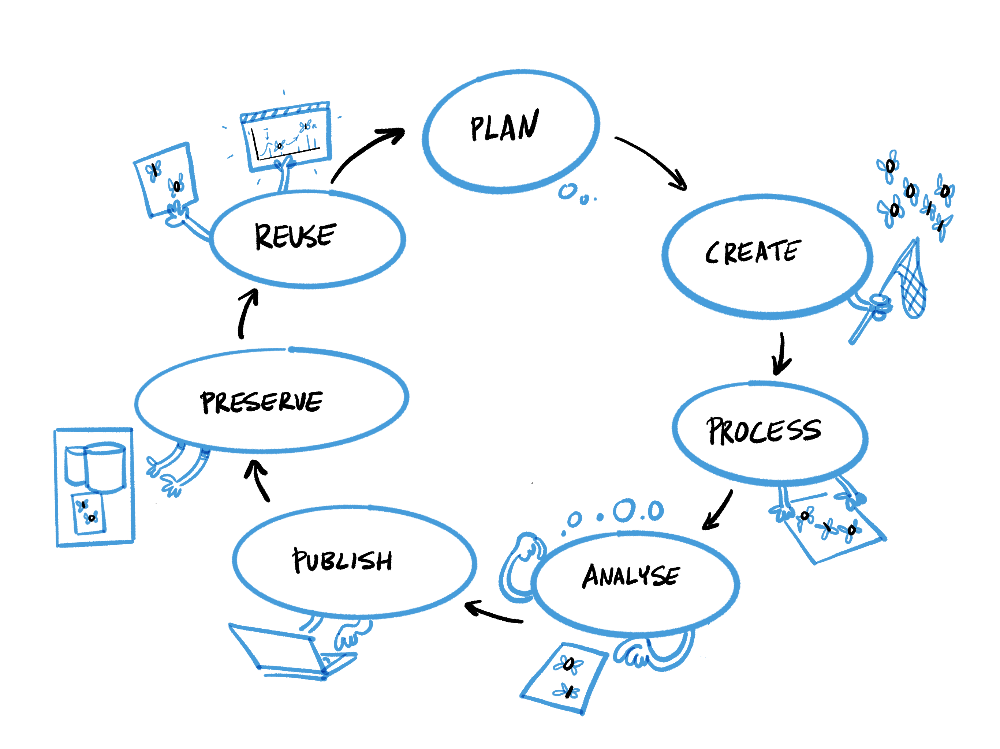

### Step 3: Select content relevant to the learning outcomes

The content of a course is the specific subject it covers. As FAIR encompasses a wide range of sub-topics, it needs to be broken down into individual content blocks, such as ‛copyright law&#39;, ‛metadata&#39; or ‛data repositories&#39;. For a more comprehensive list, see chapter 5, which can be used as a source of inspiration you can blend with your own course formats. Your choice of content and teaching format will of course depend on your audience and the time available.

When teaching the FAIR principles – as with most other topics – there is a very real danger of cramming too much content into too little time. Consequently, you should drop all content not aligned with the learning outcomes. If you identify content you deem essential but does not support the learning outcomes, e.g. an existing institutional data policy, you should adapt the learning outcomes accordingly. This also ensures that the content is aligned with the learning assessment and course evaluation covered in the following two steps.

You will probably concentrate on a specific aspect of FAIR during a talk or workshop. If, however, your course covers all FAIR-relevant topics, there are several ways to organise and connect the individual content blocks:

#### 1. Follow the FAIR acronym

Topics may be presented in the order in which they appear in the FAIR acronym: findable, accessible, interoperable, reusable. This approach makes most sense if the course&#39;s main topic is the FAIR principles from a generic or disciplinary perspective (e.g. Martinez et al. 2019). However, as several sub-topics, e.g. metadata, apply to more than one principle, and given that it is usually helpful to build on students&#39; existing knowledge, you should also consider using one of the other three approaches instead. If you do in fact opt for one of the other approaches in your course, we recommend you include a special learning unit on FAIR in your overall curriculum to link topics with the four key FAIR principles.

#### 2. Follow the research data lifecycle

The research data lifecycle (10) provides a generalised, structured look at the individual steps of how research projects handle research data. While this is clearly an idealised model, it has proven useful in teaching RDM, particularly when writing data management plans (DMPs).

_Figure 3: Research Data Lifecycle by Patrick Hochstenbach, adapted from UK Data Service, n.d._

The process starts with a research question and selection of possible approaches. Ideally, this early stage involves an exploration of existing data to see what can be reused (in part) and encompasses every aspect of FAIR here. After drafting how data will be managed (ideally supported by a data management plan), data are collected, stored, described and analysed. Selection of the data to be preserved for the long-term depends upon a number of conditions (ethical and legal restrictions, plans for further use, hardware costs, etc.). After these steps, the data can be prepared for publication and possible reuse by others, or it can serve as input for a future project.

#### 3. Link FAIR practices to data management plans and planning

A data management plan (DMP) provides guidance throughout the whole research data management process and outlines how the data relevant for the research question will be retrieved, collected, described, stored, processed, analysed, preserved for the long term, and published.

DMPs cover all core aspects of the FAIR principles. As a result, following the topics of a DMP template, e.g. Science Europe 2021, is a sound approach, especially if the motivation for the course is a requirement to deliver a DMP, e.g. for a funder, or if the course requirement is to write an individual DMP. Furthermore, a DMP, when treated as a &#39;2living document&#39; which the researcher comes back to from time to time during a project, can serve as a powerful tool to stay organised during the research process.

#### 4. Connect topics in a way that fulfils individual needs

Depending on learners&#39; existing knowledge and individual needs, content can also be ordered in other ways. This is especially relevant if the overall course has a specific topic, e.g. &#39;metadata&#39;, that you also want to present _in situ_ and with relevance to the overall FAIR landscape.

---

**(10)** Due to different disciplines and contexts, there is a large variety of such models (see, for example, Ball 2012).

---
