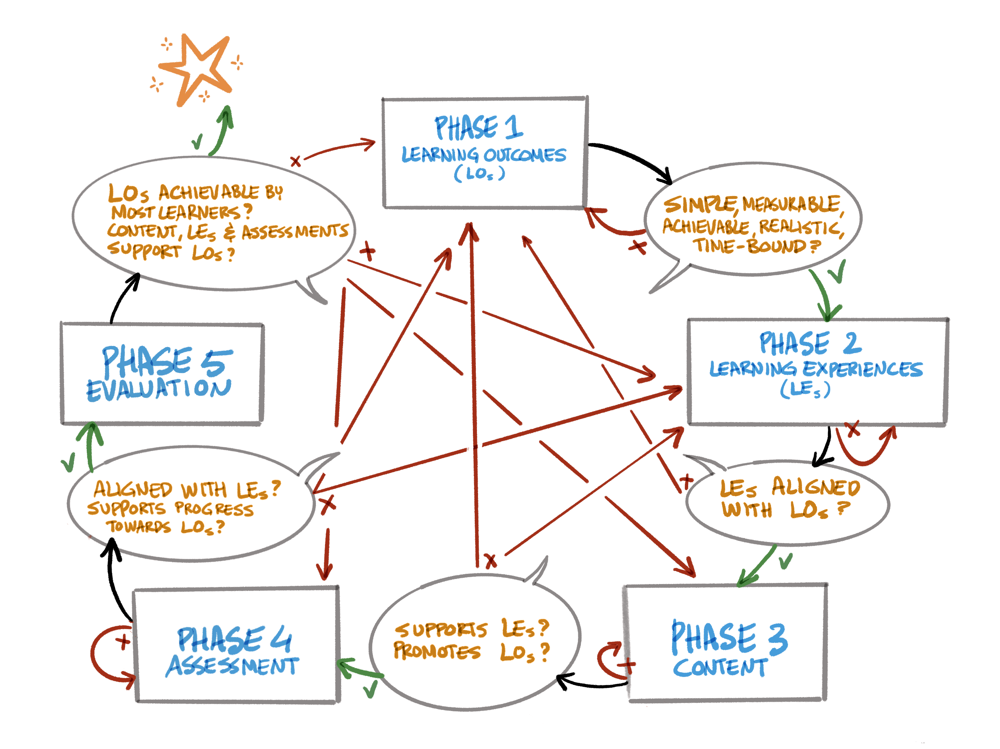

## 4.2 Elemental phases in course design

Once the needs and gaps of learners have been identified, the next steps of the course design can follow. To help teachers and trainers with this, we introduce Nicholls&#39; paradigm for curriculum development, summarised by Via et al. (2020, adapted from Tractenberg et al. 2020) into five elemental phases (see also figure 2 below).

1. **Select or identify learning outcomes (LOs):**
   - &quot;Learning Outcomes (LOs): the knowledge, skills and abilities (KSAs) that learners should be able to demonstrate after instruction, the tangible evidence that the teaching goals have been achieved; LOs are learner-centric&quot; (Via et al. 2020, p. 2, emphasis omitted).
2. **Select or develop learning experiences (LEs) that will help learners achieve the LOs:**
   - &quot;Learning Experience (LE): any setting or interaction in or via which learning takes place: e.g., a lecture, game, exercise, role-play&quot; (ibid.).
3. **Select or develop content relevant to the LOs.**
4. **Identify or develop assessments to ensure learners progress toward LOs:**
   - &quot;Assessment: the evaluation or estimation of the nature, quality or ability of someone or something&quot; (ibid.).
5. **Evaluate the course effectiveness.**

Ideally, following these steps will help teachers to create an effective learning path for their intended learners. A learning path describes the chosen route, or a set of independent learning modules, taken by a learner through a range of courses or other training events. A learning path can also consist of independent training events by learners who only need to fill specific gaps. Practical implementation of this approach should include specification of the prerequisites or entry knowledge requirements and may include an entry knowledge assessment to track the learners&#39; progress and achievements at the end of the course.

_Figure 2: Nicholls&#39; phases of curriculum design &amp; their dependencies by Patrick Hochstenbach, adapted from Via et al. (2020, p. 4). The rectangles show the key considerations in each phase. Red arrows represent revisions in the event that requirements resulting from the considerations have not been met yet, while green arrows depict a move to the next phase. If all requirements have been satisfied, the course or curriculum can be regarded as successful (represented by the star in the upper left)._

These five steps are elaborated below, not so much to explain a curriculum development theory but to help integrate FAIR in teaching, stimulate FAIR data by teaching it, and enhance reuse of existing teaching materials on the topic of FAIR (for the latter, see particularly [chapter 5](../5FAIRlessonPlans/0LessonPlans.md)).
