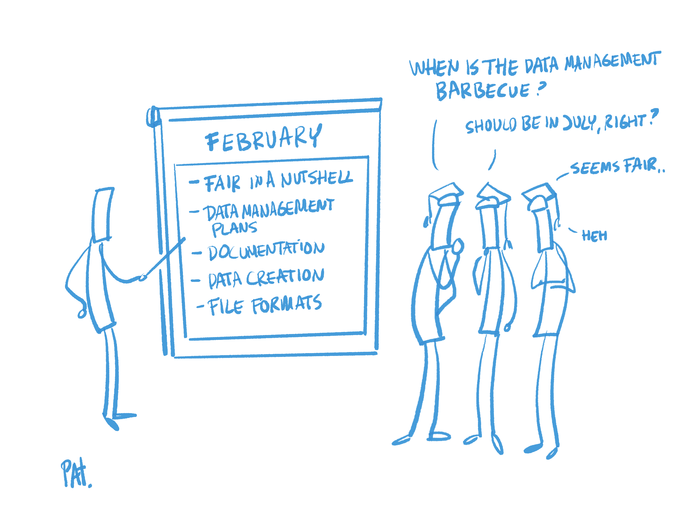

# 5. FAIR lesson plans

While [chapter 4](../4TeachingAndTrainingDesigns/1Introduction.md) introduced an approach to developing FAIR courses and elaborated on a number of relevant considerations in this respect, this chapter provides examples of lesson plans for a number of topics related to RDM and the FAIR principles. The following list of lesson plans is not exhaustive and can be updated.

List of lesson plans on RDM- and FAIR-related topics:

1. [FAIR in a nutshell](1LessonPlan.md)
2. [Data management plans (DMP)](2LessonPlan.md)
3. [Documentation](3LessonPlan.md)
4. [Data creation](4LessonPlan.md)
5. [File formats](5LessonPlan.md)
6. [Metadata](6LessonPlan.md)
7. [Data standardisation and ontologies](7LessonPlan.md)
8. [Persistent identifiers (PIDs)](8LessonPlan.md)
9. [Licences, copyright and intellectual property rights (IPR) issues](9LessonPlan.md)
10. [Finding and reusing data](10LessonPlan.md)
11. [Repositories](11LessonPlan.md)
12. [Dealing with confidential, personal, sensitive &amp; private data and ethical aspects](12LessonPlan.md)
13. [Data access](13LessonPlan.md)
14. [FAIR software/citable code](14LessonPlan.md)
15. [Research data management – overview and best practices](15LessonPlan.md)
16. [Data management and governance in industry and research](16LessonPlan.md)
 
All lesson plans follow the [same format](https://docs.google.com/document/d/1YO6U4Rq5s-g6dnpTVu6BD42jwt2-UqYiNFqZmzGKc2c/edit#heading=h.fzyhfqsl05zv) (11) which includes the FAIR elements concerned, the learning outcomes, a summary of tasks/actions, material/equipment needed, references and take-home tasks. More details on the implementation of FAIR aspects, i.e. the practical application of the content taught through the lesson plans, are provided in [chapter 6](../6ImplementingFAIR/1Introduction.md).

_Table 8: Mapping of lesson plans to FAIR principles_

| **Lesson** | | **F1** | **F2** | **F3** | **F4** | | **A1** | **A2** | | **I1** | **I2** | **I3** | | **R1** |
| --- | --- | --- | --- | --- | --- | --- | --- | --- | --- | --- | --- | --- | --- | --- |
| FAIR in a nutshell | | X | X | X | X | | X | X | | X | X | X | | X |
| Data management plans | | X | X | X | X | | X | X | | X | X | X | | X |
| Documentation | | | | | | | | | | | | | | X |
| Data creation | | X | X | X | X | | X | X | | X | X | X | | X |
| File formats | | X | X | X | X | | X | X | | X | X | X | | X |
| Metadata | | X | X | X | X | | X | X | | X | X | X | | X |
| Data standardisation and ontologies | | X | | | | | X | X | | X | | | | X |
| Persistent identifiers | | X | X | X | X | | X | X | | | | | | |
| Licences, copyright and intellectual property rights issues | | | | | | | | | | | | | | X |
| Finding and reusing data | | | | | | | | | | | | | | X |
| Repositories | | X | X | X | X | | X | X | | X | X | X | | X |
| Dealing with confidential, personal, sensitive and private data and ethical aspects | | | | | | | X | X | | | | | | X |
| Data access | | X | X | X | X | | X | X | | X | X | X | | |
| FAIR software/citable code | | X | X | X | X | | X | X | | X | X | X | | X |
| Research data management – overview and best practices | | X | X | X | X | | X | X | | X | X | X | | X |
| Data management and governance in industry and research | | X | X | X | X | | X | X | | X | X | X | | X |

_Table 9: Mapping of the competence profile topics to the lesson plans_

| **Topic** | **Number of relevant lesson plan** (number in parantheses: the plan partly addresses the topic) |
| --- | --- |
| General principles and concepts in data management – overview | 15, (4) |
| Overview of data types, data type registries and data formats | (5) |
| Metadata, metadata formats, standards and registries | 6 |
| Open Research, Open Access, Open Data | 15, (9) |
| Metadata management, registries and publication | (6) |
| Persistent Identifiers (PID), Open Researcher and Contributor ID (ORCID), Research Organization Registry (ROR) | 8 |
| FAIR (Findable, Accessible, Interoperable, Reusable) principles in data management | 1, (16) |
| FAIR metadata management and tools for FAIR metadata management | (6) |
| Databases and database management systems, data modelling | (16) |
| Data structures | |
| Master data management, data dictionaries | 3, (16) |
| FAIR data management requirements and compliance | (1) |
| Data management including reference and master data | (16) |
| Data storage and operations | |
| Data infrastructure, data registries and data factories | (16) |
| Data security and protection | (12) |
| Data backup | |
| Personal data protection, GDPR compliance | 12, (15), (16) |
| Data anonymisation/pseudonymisation | 12 |
| Data management planning, FAIR data management and compliance | 2, (1), (15), (16) |
| Data integration and interoperability, data preparation and cleaning | 7 |
| Data interoperability and metadata management | (7) |
| Organisational roles in data governance, data stewardship | (15),(16) |
| Data provenance, data lineage | (8) |
| Responsible data use, data privacy, ethical principles, Intellectual Property Rights (IPR) and legal issues | 12, (15) |
| Data quality management, best practices and frameworks, data quality metrics | (2) |
| Data protection policies (including personal data), data access policies, GDPR (General Data Protection Regulation) compliance | 12, 13 |
| Trusted data repositories and certification | 11 |
| Data discovery (published data), data selection and use in research | 10 |
| Research data lifecycle | (4) |
| Ontologies and controlled vocabularies | 7 |

---

**(11)** The lesson plan template used here is based on this template: [https://www.class-templates.com/support-files/lpt\_word\_001-printable\_lesson\_plan\_template.pdf](https://www.class-templates.com/support-files/lpt_word_001-printable_lesson_plan_template.pdf)

----
