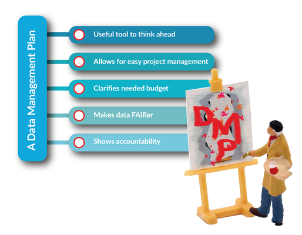

## Lesson plan 2: Data management plans (DMP)

**FAIR elements:** All (see Summary of Tasks/Actions 1. a) for more detail)

**Primary audience(s):** Bachelor&#39;s, Master&#39;s, PhD degree students

**Learning outcomes:**

- Can describe what a data management plan is
- Can explain why data management planning is a step towards FAIR
- Can tell which areas should be covered in a DMP
- Can sketch a DMP for their own research project
- or (depending on scope and intensity of the lesson): Can develop detailed DMP according to funder requirements and engage with relevant university instances/authorities
- Can collaborate on a DMP and modify the plan during the project (&#39;living document&#39;)
- Can apply principles to protect personal sensitive data and develop a data protection impact assessment, if required (depending on discipline)
- Can summarise best practices in data quality (principles, benefits, standards and tools)
- Understands when it is appropriate to create plans and knows the difference between DMP and other types of documents for the project, e.g. project management plan
- Knows tools, guides, templates and other types of support for DMP creation
- Knows the common difficulties during DMP creation
- Understands the concept of the machine-actionable DMP

**Summary of tasks/actions:**

1. Introduction to data management plan (DMP)
   1. DMP with reference to FAIRness
       A good data management plan covers all _**FAIR principles (Findable, Accessible, Interoperable, Reusable)**_(17).
       A DMP helps to make the data _**Findable (F principle)**_ because it includes all information about where data is stored and preserved, during and after the project. Moreover, a DMP also contains information about persistent identifiers, e.g. DOI, along with a description of the data and metadata standards used.
       A DMP helps to make the data _**Accessible (A principle)**_ because it also includes information about how data can be accessed, what is required to access the data (authentication or authorisation) and by what (standardised and universal) communications protocol, e.g. HTTP, HTTPS.
       A DMP helps to make the data _**Interoperable (I principle)**_, indicating which metadata standards, vocabularies, methodologies, and tools were used to facilitate interoperability. Moreover, a machine-actionable DMP also helps to address the ability of different systems and services to exchange both metadata and data produced during the project.
       A DMP helps to make the data _**Reusable (R principle)**_ because it allows data to be described with more detail and accuracy, making it easier for others to understand. Moreover, during DMP creation, it is necessary to indicate the information that is needed to prepare the data for sharing and reuse with appropriate licences and rules, namely, how the data can be reused and for whom the data may be valuable.

   2. Benefits, advantages and importance of DMP creation for researchers, their host institutions and funders:  
    Source: CESSDA Data Management Expert Guide (18)), [CC BY-SA 4.0](https://creativecommons.org/licenses/by-sa/4.0/deed.en_US).
   3. When is a DMP needed, at what stage of the project?
2. Content of a good DMP
   1. Context of the project (brief description and examples)
   2. Data and resources produced/collected during the project (brief description of the type and formats of the data; examples)
   3. Methodologies used for data collection (brief description and examples)
   4. Organisation of the data during the project and in datasets (brief description of the structure and names of the folders and files; examples)
   5. Metadata and metadata standards (brief description and examples
   6.  Documentation (brief description of the additional documentation, such as confidentiality agreements, agreements between partners, informed consent, authorisation by Ethics Committee, Data Protection Impact Assessment (DPIA) or Data Protection agreement that can substitute DPIA; examples)
   7.  Data quality procedures during data collection, data processing, data sharing and reuse
      1. What does data quality mean in research data management?
      2. Quality assurance guidelines (data description, metadata standards, documentation, data checking, etc.)
      3. Ensure quality control (curation processes, data entry programs, use of standardised data formats, etc.)
         1. documenting the calibration of instruments
         2. taking duplicate samples or measurements
         3. standardised data capture, data entry or recording methods
         4. data entry validation techniques
         5. methods of transcription
         6. peer review of data
      4. Data quality for publishing in repositories (completeness, uniqueness, timeliness, validity, accuracy, consistency)
      5. Data quality assessment (data quality checklist)
   8.  Ethics and intellectual property (brief description and examples)
   9.  Data sharing (data access and reuse) (brief description and examples)
   10. Data storage and backup (brief description and examples)
   11. Selection and preservation of data (brief description and examples)
   12. Responsibilities for managing data and resources (brief description and examples)
   13. Additional information (such as the DMP monitoring and update process, and its importance) (brief description and examples)
3. Tools for DMP creation
   1. [DMPOnline](https://dmponline.dcc.ac.uk/) (brief description and demonstration of the tool)
   2. [Data Steward Wizard](https://ds-wizard.org/) (brief description and demonstration of the tool)
   3. [Argos DMP](https://argos.openaire.eu/splash/) (brief description and demonstration of the tool)
4. Guides and templates that help create a DMP
   1. Guides developed by government institutions and funders (e.g. Guidelines on FAIR Data Management in Horizon 2020) (brief description and examples)
   2. Guides for specific domains, e.g. cancer research, clinical research, biological research (brief description and examples)
   3. Checklists, frameworks, e.g. Digital Curation Centre (DCC), Inter-university Consortium for Political and Social Research (ICPSR), Framework for Creating a Data Management Plan (brief description and examples)
5. Support for DMP at the institution
   1. Data Steward (brief description and responsibilities)
   2. Data Protection Officer (brief description and responsibilities)
   3. Research data support in library (brief description and responsibilities)
   4. Other types of support, e.g. IT staff, grant administrator, funder officer, project managers (brief description and responsibilities)
6. A different approach to DMP creation for sensitive, personal and private data
   1. Difference between these types of data (brief description and examples)
   2. Additional documents and procedures, GDPR, connection with ethics committee, DPO, DPIA (brief description and examples)
7. Common difficulties in DMP creation (brief description of each point and examples)
8. Creation of the DMP for a project relevant for learners (practice session with a presentation and defence)

**Materials/Equipment**

- Computer/laptop
- Internet
- [DMPOnline](https://dmponline.dcc.ac.uk/) or other tool that helps to create a DMP

**References**

***Definitions***

- Clare, C., et al.: The Cookbook, Engaging Researchers with Data Management (2019). [https://doi.org/10.11647/OBP.0185](https://doi.org/10.11647/OBP.0185)
- Michener WK (2015) Ten Simple Rules for Creating a Good Data Management Plan. PLoS Comput Biol 11(10): e1004525. [https://doi.org/10.1371/journal.pcbi.1004525](https://doi.org/10.1371/journal.pcbi.1004525)
- Dominik Schmitz, Daniela Hausen, Ute Trautwein-Bruns: Content of a Data Management Plan. RWTH Aachen University. 2020. Available at DOI: [http://doi.org/10.18154/RWTH-2019-10064](http://doi.org/10.18154/RWTH-2019-10064), [https://youtu.be/fcCj6sNvoOw](https://youtu.be/fcCj6sNvoOw)
- [Research Data Netherlands](https://www.youtube.com/channel/UCPdYOhL96exPtm_II-BO5og): The what, why and how of data management planning, 2014, [https://youtu.be/gYDb-GP1CA4](https://youtu.be/gYDb-GP1CA4)
- Juran, Joseph M., and A. Blanton Godfrey. Juran&#39;s quality handbook: Fifth Edition. McGraw-Hill Education, 1998. Available at: [https://gmpua.com/QM/Book/quality%20handbook.pdf](https://gmpua.com/QM/Book/quality%20handbook.pdf)
- Chapman, Arthur D. Principles of data quality. GBIF, 2005. [https://docs.niwa.co.nz/library/public/ChaArPrindq.pdf](https://docs.niwa.co.nz/library/public/ChaArPrindq.pdf)
- OpenAire. [https://www.openaire.eu/when-do-i-have-to-create-a-data-management-plan](https://www.openaire.eu/when-do-i-have-to-create-a-data-management-plan)
- Miksa T, Simms S, Mietchen D, Jones S (2019) Ten principles for machine-actionable data management plans. PLoS Comput Biol 15(3): e1006750. [https://doi.org/10.1371/journal.pcbi.1006750](https://doi.org/10.1371/journal.pcbi.1006750)
- Science Europe: Practical Guide to the International Alignment of Research Data Management, [https://doi.org/10.5281/zenodo.4915861](https://doi.org/10.5281/zenodo.4915861)

***Tools***

- [DMP Online](https://dmponline.dcc.ac.uk/)
- [Argos DMP](https://argos.openaire.eu/splash/)
- [Data Steward Wizard](https://ds-wizard.org/)
- [GFBio tool for DMP](https://www.gfbio.org/plan)
- [An inventory of tools for converting your data to RDF](https://fairplus.github.io/the-fair-cookbook/content/recipes/interoperability/rdf-conversion.html)
- [Software quality checklist](https://fair-software.nl/recommendations/checklist/)
- [QAMyData](https://blog.ukdataservice.ac.uk/introducing-qamydata/)

***Useful links***

- [The Turing Way: Data Management Plan](https://the-turing-way.netlify.app/reproducible-research/rdm/rdm-dmp.html)
- [Metadata Standards Catalog](https://rdamsc.bath.ac.uk/scheme-index)
- [FAIRsharing - data and metadata standards](https://fairsharing.org/standards/)
- [Data Management Plans Stanford Libraries](https://library.stanford.edu/research/data-management-services/data-management-plans)
- [Horizon 2020 DMP Template](https://ec.europa.eu/research/participants/docs/h2020-funding-guide/cross-cutting-issues/open-access-data-management/data-management_en.htm)
- [DCC Data Management Plan](https://www.dcc.ac.uk/resources/data-management-plans)
- [OpenAire DMP creation](https://www.openaire.eu/how-to-create-a-data-management-plan)
- [DMP Templates](https://guides.lib.umich.edu/c.php?g=283277&amp;p=2138498)
- [CC Licenses](https://creativecommons.org/about/cclicenses/)
- [Personal Data](https://ec.europa.eu/info/law/law-topic/data-protection/reform/what-personal-data_en)
- [GDPR](https://eur-lex.europa.eu/eli/reg/2016/679/oj)
- [DPIA](https://ico.org.uk/for-organisations/guide-to-data-protection/guide-to-the-general-data-protection-regulation-gdpr/data-protection-impact-assessments-dpias/what-is-a-dpia/)
- [CESSDA DMP Checklist](https://www.cessda.eu/content/download/4302/48656/file/TTT_DO_DMPExpertGuide_v1.3.pdf)
- [CESSDA Data Management Expert Guide](http://www.cessda.eu/dmeg)
- [DCC Checklist for DMP](https://www.dcc.ac.uk/DMPs/checklist)
- [ICPSR Framework for DMP creation](https://www.icpsr.umich.edu/web/pages/datamanagement/dmp/framework.html)
- [The MIT Total Data Quality Management Program (TDQM)](http://web.mit.edu/tdqm/www/index.shtml)
- [Data Quality Review](https://apps.who.int/iris/bitstream/handle/10665/259224/9789241512725-eng.pdf?%20sequence=1)
- [DLCM DMP tools](https://www.dlcm.ch/resources/dlcm-dmp)

***Use cases / Examples of DMP***

- [CESSDA DMP Questions Qualitative Data](https://www.cessda.eu/content/download/3536/33233/file/DMPQuestionsQualitativeData.pdf)
- [CESSDA DMP Questions Quantitative Data](https://www.cessda.eu/content/download/3537/33238/file/DMPQuestionsQuantitativeData.pdf)
- [Cancer research (CRUK)](https://www.cancerresearchuk.org/sites/default/files/hands_on_data_sharing_advice_-_basic_science.pdf)
- [Clinical research (CRUK)](https://www.cancerresearchuk.org/sites/default/files/hands_on_data_sharing_advice_-_clinical.pdf)
- [Population research (CRUK)](https://www.cancerresearchuk.org/sites/default/files/hands_on_data_sharing_advice_-_population.pdf)
- [Biological research (NSF)](https://www.nsf.gov/bio/biodmp.jsp)
- Karimova Y., Ribeiro C., David G. (2021) Institutional Support for Data Management Plans: Five Case Studies. In: Garoufallou E., Ovalle-Perandones MA. (eds) Metadata and Semantic Research. MTSR 2020. Communications in Computer and Information Science, vol 1355. Springer, Cham. [https://doi.org/10.1007/978-3-030-71903-6\_29](https://doi.org/10.1007/978-3-030-71903-6_29)
- Barbosa, Susana &amp; Karimova, Yulia. (2020). SAIL Data Management Plan (Version 1.0.0). Zenodo. [https://doi.org/10.5281/zenodo.4286210](https://doi.org/10.5281/zenodo.4286210)
- Diepenbroek, M., et al. (2014). Biodiversity and Ecological Research Data: Towards an integrated biodiversity and ecological research data management and archiving platform: the German federation for the curation of biological data (GFBio). In: Plödereder, E., Grunske, L., Schneider, E. &amp; Ull, D. (Hrsg.), Informatik 2014. Bonn:Gesellschaft für Informatik e.V. (p. 1711-1721). [https://dl.gi.de/handle/20.500.12116/2782](https://dl.gi.de/handle/20.500.12116/2782)
- [Best Practices for Biomedical Research Data Management](https://doi.org/10.17605/OSF.IO/VRNFX)
- [Harvard Longwood Medical Area Research Data Management Working Group](https://datamanagement.hms.harvard.edu/)

***Use cases/Examples of data quality processes***

- Biodiversity:
  - OECD (2017), &quot;Data quality&quot;, in OECD Handbook for Internationally Comparative Education Statistics: Concepts, Standards, Definitions and Classifications, OECD Publishing, Paris, [https://doi.org/10.1787/9789264279889-9-en](https://doi.org/10.1787/9789264279889-9-en).
  - Chapman, A. D. 2005. Principles of Data Quality, version 1.0. Report for the Global Biodiversity Information Facility, Copenhagen. Url:[https://docs.niwa.co.nz/library/public/ChaArPrindq.pdf](https://docs.niwa.co.nz/library/public/ChaArPrindq.pdf)
  - Chapman, A., Belbin, L., Zermoglio, P., Wieczorek, J., Morris, P., &amp; Nicholls, M. et al. (2020). Developing Standards for Improved Data Quality and for Selecting Fit for Use Biodiversity Data. Biodiversity Information Science And Standards, 4. doi: [https://doi.org/10.3897/biss.4.50889](https://doi.org/10.3897/biss.4.50889)
  - [Biodiversity Data Quality Interest Group (TDWG)](https://www.tdwg.org/community/bdq/)
- Agriculture:
  - [Agriculture Statistics Data Quality](http://www.fao.org/3/i3664e/i3664e.pdf)
  - [Agriculture Data Quality](https://f1000research.com/slides/6-1766)
- Medicine and Biomedicine:
  - [Medical Data Quality](https://www.sciencedirect.com/science/article/pii/S0010482519300733)
- Geospatial:
  - [Geospatial databases](https://www.geos.ed.ac.uk/~gisteac/gis_book_abridged/files/ch12.pdf)
- Sensoring:
  - SAIL and Sensor data quality control procedures:
    - [Documentation of Sensor Data Correction Script](https://doi.org/10.5281/zenodo.4518864)
    - [Geo-referencing Data. GNSS Post-processing](https://zenodo.org/record/4447619#.YMBOAfkzaUl)

**Take-home tasks**

1. Analysis of existing metadata standards: [https://rdamsc.bath.ac.uk/scheme-index](https://rdamsc.bath.ac.uk/scheme-index) and [https://fairsharing.org/standards](https://fairsharing.org/standards)
2. Choosing the right licence for data, e.g. [https://ufal.github.io/public-license-selector/](https://ufal.github.io/public-license-selector/), more information on this can also be found in [lesson plan 9](../D7-4_How_to_be_FAIR_with_your_data_v1-0_20211221-korr_ce.docx#lesson_plan_9)
3. Analysis of the DMP examples for scientific domain relevant to learners
4. Analysis of the examples of the data quality procedures
5. Datasets validation from data quality perspective
6. Creation of a data quality policy for an specific use case
7. Creation of the DMP for a project relevant for learners
8. Preparation of a presentation for defence

**(17)** [https://www.go-fair.org/fair-principles/](https://www.go-fair.org/fair-principles/)

**(18)** [https://www.cessda.eu/var/cessda/storage/images/cessda-training/expert-tour-guide/a-training/20171119_benefitsdmp_tekengebied-12/33308-1-eng-GB/20171119_BenefitsDMP_Tekengebied-1_large.png](https://www.cessda.eu/var/cessda/storage/images/cessda-training/expert-tour-guide/a-training/20171119_benefitsdmp_tekengebied-12/33308-1-eng-GB/20171119_BenefitsDMP_Tekengebied-1_large.png)
