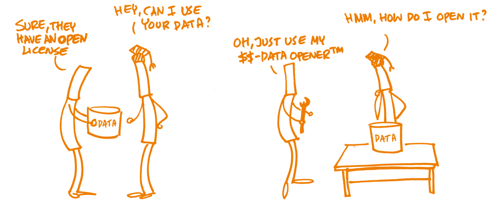

## Lesson plan 9: Licences, copyright and intellectual property rights (IPR) issues

**FAIR elements:**

**Reusable**

The ultimate goal of FAIR is to optimise the reuse of data. To achieve this, metadata and data should be well-described so that they can be replicated and/or combined in different settings.

[**R1.** (Meta)data are richly described with a plurality of accurate and relevant attributes](https://www.go-fair.org/fair-principles/r1-metadata-richly-described-plurality-accurate-relevant-attributes/)

[**R1.1.** (Meta)data are released with a clear and accessible data usage license](https://www.go-fair.org/fair-principles/r1-1-metadata-released-clear-accessible-data-usage-license/)

[**R1.2.** (Meta)data are associated with detailed provenance](https://www.go-fair.org/fair-principles/r1-2-metadata-associated-detailed-provenance/)

[**R1.3.** (Meta)data meet domain-relevant community standards](https://www.go-fair.org/fair-principles/r1-3-metadata-meet-domain-relevant-community-standards/)

**Primary audience(s)**: Bachelor&#39;s, master&#39;s, PhD degree students

**Learning outcomes**:

- Understand what licences are, their purpose and relation with the FAIR principle
- Know how the data can be reused and shared with others
- Be able to identify the owner of the data for a project which may or may not have many partners
- Know what copyright and intellectual property rights are
- Be aware that different copyright rules exist in different countries (and that there are countries without copyright law)
- Know the different types of rights (economic and moral)
- Know the different types of licences and understand what actions can be performed with them, e.g. [CC](https://creativecommons.org/licenses/), [ODbL](https://opendatacommons.org/licenses/odbl/), [ACA](https://www.kielipankki.fi/support/clarin-eula/), [OGL](https://www.nationalarchives.gov.uk/doc/open-government-licence/version/3/), [LGPL](https://www.synopsys.com/blogs/software-security/5-types-of-software-licenses-you-need-to-understand/)
- Know the meaning of non-commercial and commercial licences, e.g. CC BY-NC
- Know the different types of restrictions
- Know tools and guides to choose the correct licence
- Apply the acquired knowledge in practice, e.g. quiz, exercises

**Summary of tasks/actions:**

1. Introduction to licences and (re)use issues;
   1. FAIR focus on reusability, namely on [R1.1. (Meta)data are released with a clear and accessible data usage license point](https://www.go-fair.org/fair-principles/r1-1-metadata-released-clear-accessible-data-usage-license/) of the FAIR principles. Licences, copyright and IPR issues help to clarify the FAIR reusable principle. They help identify legal, ethical and usage rights, understand who owns the copyright and IPR. Moreover, these issues help to prepare your data for professional reuse with or without restrictions, with an appropriate licence, while protecting you as licence holder and avoiding unpleasant situations surrounding reuse of data.
   2. What licences are, their purpose and importance
   3. What type of digital object should and can be licensed (data, software, code, etc.)
   4. Understand the differences between licences used for data and software
2. Copyright and intellectual property rights
   1. Definition
   2. Type of intellectual property rights, e.g. copyright, patents, trademarks, industrial design rights, plant varieties, trade dress, trade secrets, database rights
   3. Purpose of copyright
   4. Copyright protected works; examples (e.g. [All rights reserved (fully copyrighted](https://www.wur.nl/en/article/What-does-All-rights-reserved-mean.htm))
      1. Is (research) data protected by copyright law in the same way as other works?
         1. Let participants define research data they work with
         2. Explain the difference between copyright protected works and works that are not copyright protected (like pure information or facts), and show examples
   5. Copyright exceptions; examples (e.g. [Copyright exceptions](https://libguides.northampton.ac.uk/copyright/exceptionsandfairdealings));
   6. What information do you need to provide when contacting the copyright holder?
      1. What you will be using (amount and content)
      2. Context in which the work will be used
      3. Where you intend to use the work, e.g. publicly online
      4. For what purpose, e.g. educational, commercial, personal
      5. How they will be attributed
3. Usage rights: what does it mean? (Brief description and examples);
   1. Definition
   2. Type of rights, e.g. economic and moral; non-exclusive rights of use and exclusive rights of use;
   3. What permissions do you have with a licence? (e.g. distribute, remix, adapt, build upon a material)
4. Different types of licences
   1. Creative Commons;
      1. [CC0 - No Rights Reserved](https://creativecommons.org/share-your-work/public-domain/cc0/)
      2. [Attribution CC BY](https://creativecommons.org/share-your-work/licensing-types-examples/licensing-examples/#by)
      3. [Attribution ShareAlike CC BY-SA](https://creativecommons.org/share-your-work/licensing-types-examples/licensing-examples/#sa)
      4. [Attribution-NoDerivs CC BY-ND](https://creativecommons.org/share-your-work/licensing-types-examples/licensing-examples/#nd)
      5. [Attribution-NonCommercial CC BY-NC](https://creativecommons.org/share-your-work/licensing-types-examples/licensing-examples/#nc)
      6. [Attribution-NonCommercial-ShareAlike CC BY-NC-SA](https://creativecommons.org/share-your-work/licensing-types-examples/licensing-examples/#by-nc-sa)
      7. [Attribution-NonCommercial-NoDerivs CC BY-NC-ND](https://creativecommons.org/share-your-work/licensing-types-examples/licensing-examples/#by-nc-nd)
   2. Software licences
      1. [Public domain](https://www.synopsys.com/blogs/software-security/5-types-of-software-licenses-you-need-to-understand/)
      2. [Permissive](https://www.synopsys.com/blogs/software-security/5-types-of-software-licenses-you-need-to-understand/)
      3. [LGPL(GNU)](https://www.synopsys.com/blogs/software-security/5-types-of-software-licenses-you-need-to-understand/)
      4. [Copyleft](https://www.synopsys.com/blogs/software-security/5-types-of-software-licenses-you-need-to-understand/)
      5. [Proprietary](https://www.synopsys.com/blogs/software-security/5-types-of-software-licenses-you-need-to-understand/)
   3. Open Source Licences
      1. [Apache License 2.0](https://opensource.org/licenses/Apache-2.0)
      2. [BSD 3-Clause &quot;New&quot; or &quot;Revised&quot; license](https://opensource.org/licenses/BSD-3-Clause)
      3. [BSD 2-Clause &quot;Simplified&quot; or &quot;FreeBSD&quot; license](https://opensource.org/licenses/BSD-2-Clause)
      4. [GNU General Public License (GPL)](https://opensource.org/licenses/gpl-license)
      5. [GNU Library or &quot;Lesser&quot; General Public License (LGPL)](https://opensource.org/licenses/lgpl-license)
      6. [MIT license](https://opensource.org/licenses/MIT)
      7. [Mozilla Public License 2.0](https://opensource.org/licenses/MPL-2.0)
      8. [Common Development and Distribution License](https://opensource.org/licenses/CDDL-1.0)
      9. [Eclipse Public License version 2.0](https://opensource.org/licenses/EPL-2.0)
   4. Other types of licences
      1. [ODbL](https://opendatacommons.org/licenses/odbl/1-0/)
      2. [ACA](https://www.kielipankki.fi/support/clarin-eula/)
      3. [OGL](http://www.nationalarchives.gov.uk/doc/open-government-licence/version/3/)
   5. [Orphan works](https://www.gov.uk/guidance/copyright-orphan-works#overview) and [search guidance for applicants](https://www.gov.uk/government/publications/orphan-works-diligent-search-guidance-for-applicants)
   6. Remember: Licence-free is not the same as a free licence    Image source:
[https://open-science-training-handbook.gitbook.io/book/open-science-basics/open-licensing-and-file-formats](https://open-science-training-handbook.gitbook.io/book/open-science-basics/open-licensing-and-file-formats)
5. Tools to help choose the right licence
   1. [EUDAT licensing tool/wizard](https://ufal.github.io/public-license-selector/)
   2. [CC License chooser](https://creativecommons.org/choose/)
   3. [Choose an open source license](https://choosealicense.com/)
   4. [CLARIN License Calculator](https://www.clarin.eu/content/clarin-license-category-calculator)
6. Ownership of data
   1. Who owns the data?
   2. Show the different ownership possibilities and explain that in many cases, ownership of data may be regulated by employment and service contracts
7. How to resolve FAIR compliance with IPR restricted data
   1. Show examples of IPR, sensitive data, and other data that cannot be fully open. Explain how the metadata of this type of data can be open
8. Play [Copyright the Card Game](https://copyrightliteracy.org/resources/copyright-the-card-game/)
9.  Application of knowledge in practice (quiz, exercises)
    1.  Example: Which licence may you grant if you want to combine data with the following licences:
        1.  CC BY and CC BY-SA?
        2.  CC BY-SA and CC BY-NC?
        3.  CC BY and CC BY-ND?
10. Do an exercise related to searchability and licence issues, e.g. search for images on Google filtering by different licence types

**Materials/Equipment**

- Computer/laptop
- Internet/browser
- Different tools for choosing licences, e.g. [EUDAT License Selector](https://ufal.github.io/public-license-selector/)

**References**

_**Definitions**_

- [Creative Commons Licences](https://creativecommons.org/)
- [Open Data Commons Licences](https://opendatacommons.org/licenses/odbl/)
- Ball, A. (2014). How to License Research Data DCC How-to Guides. Edinburgh: Digital Curation Centre. Available online: [http://www.dcc.ac.uk/resources/how-guides](http://www.dcc.ac.uk/resources/how-guides)
- [https://opendefinition.org/licenses/](https://opendefinition.org/licenses/)
- Nemlioglu, Ilayda. &quot;A comparative analysis of intellectual property rights: a case of developed versus developing countries.&quot; Procedia Computer Science 158 (2019): 988-998. [https://doi.org/10.1016/j.procs.2019.09.140](https://doi.org/10.1016/j.procs.2019.09.140)
- Margoni, Thomas, &amp; Tsiavos, Prodromos. (2018). Toolkit for Researchers on Legal Issues. Zenodo. [https://doi.org/10.5281/zenodo.2574619](https://doi.org/10.5281/zenodo.2574619)
- [International Copyright Basics](https://www.rightsdirect.com/international-copyright-basics/)
- [CESSDA Licensing your data](https://www.cessda.eu/Training/Training-Resources/Library/Data-Management-Expert-Guide/6.-Archive-Publish/Publishing-with-CESSDA-archives/Licensing-your-data)
- [Ownership of WUR research data](https://www.wur.nl/en/Value-Creation-Cooperation/Collaborating-with-WUR-1/WDCC/Data-Management-WDCC/Data-policy/Data-ownership-Policy.htm)
- [How copyright protects your work](https://www.gov.uk/copyright/how-long-copyright-lasts)
- [Creative Commons Public Domain](https://creativecommons.org/share-your-work/public-domain/pdm/)
- [Using somebody else&#39;s intellectual property](https://www.gov.uk/using-somebody-elses-intellectual-property/copyright)
- [Open Science Training Handbook. Open Licensing and File Formats](https://open-science-training-handbook.gitbook.io/book/open-science-basics/open-licensing-and-file-formats)
- Guibault, Lucie, and Andreas Wiebe. _Safe to Be Open_. 2013, DOI:[10.17875/gup2013-160](https://doi.org/10.17875/gup2013-160).
- Burrow, Sheona; Margoni, Thomas and McCutcheon, Valerie (2018), Information Guide: Introduction to Ownership of Rights in Research Data. CREATe, University of Glasgow. [http://eprints.gla.ac.uk/171314/](http://eprints.gla.ac.uk/171314/)
- Burrow, Sheona; Margoni, Thomas and McCutcheon, Valerie (2018), Information Guide: Making Research Data Available. CREATe, University of Glasgow. [http://eprints.gla.ac.uk/171315/](http://eprints.gla.ac.uk/171314/)
- Burrow, Sheona; Margoni, Thomas and McCutcheon, Valerie (2018), Information Guide: Choosing a Licence for Research Data. CREATe, University of Glasgow. [http://eprints.gla.ac.uk/171316/](http://eprints.gla.ac.uk/171314/)
- Burrow, Sheona; Margoni, Thomas and McCutcheon, Valerie (2018), Information Guide: Using Research Data. CREATe, University of Glasgow. [http://eprints.gla.ac.uk/171317/](http://eprints.gla.ac.uk/171314/)

_**Tools**_

- [Creative Commons. Choose a License](https://creativecommons.org/choose/)
- [Tool for choosing an open source license](https://choosealicense.com/)
- [EUDAT License Selector](https://ufal.github.io/public-license-selector/)
- [CLARIN License Category Calculator](https://www.clarin.eu/content/clarin-license-category-calculator)

**Examples**

1. An example of the existence of different data owners in the same project. Barbosa, Susana, &amp; Karimova, Yulia. (2020). SAIL Data Management Plan (Version 1.0.0). Zenodo. [https://doi.org/10.5281/zenodo.4286210](https://doi.org/10.5281/zenodo.4286210)
2. [Examples of Usage Rights](https://www.lawinsider.com/dictionary/usage-rights)
3. [Copyright Examples](https://termly.io/resources/articles/copyright-examples/#copyright-examples)
4. [What can be Copyrighted (Examples)](https://www.legalzoom.com/knowledge/copyright/topic/what-can-be-copyrighted)
5. [Ownership of WUR research data](https://www.wur.nl/en/Value-Creation-Cooperation/Collaborating-with-WUR-1/WDCC/Data-Management-WDCC/Data-policy/Data-ownership-Policy.htm)

**Take-home tasks**

1. Looking at your own research project (master&#39;s thesis, PhD thesis, etc.), work through the information provided and identify what permissions you will need, and also what licences or copyright you would like to publish your work under.
2. Analyse different content with different licences, e.g. Flickr, YouTube, Wikimedia Commons, Vimeo, Wikipedia and the Internet Archive, Google.
3. See and analyse examples of the CC0 licence ([https://creativecommons.org/2017/02/07/met-announcement/](https://creativecommons.org/2017/02/07/met-announcement/)). Identify the specificity of this licence.
4. Find some examples of the real cases related to the licence, copyright and IPR issues, e.g. the case between Coca-Cola and Yotvata: [https://www.youtube.com/watch?v=2nyhjM2BDQU&amp;ab\_channel=EliLevineGoldberg](https://www.youtube.com/watch?v=2nyhjM2BDQU&amp;ab_channel=EliLevineGoldberg).
