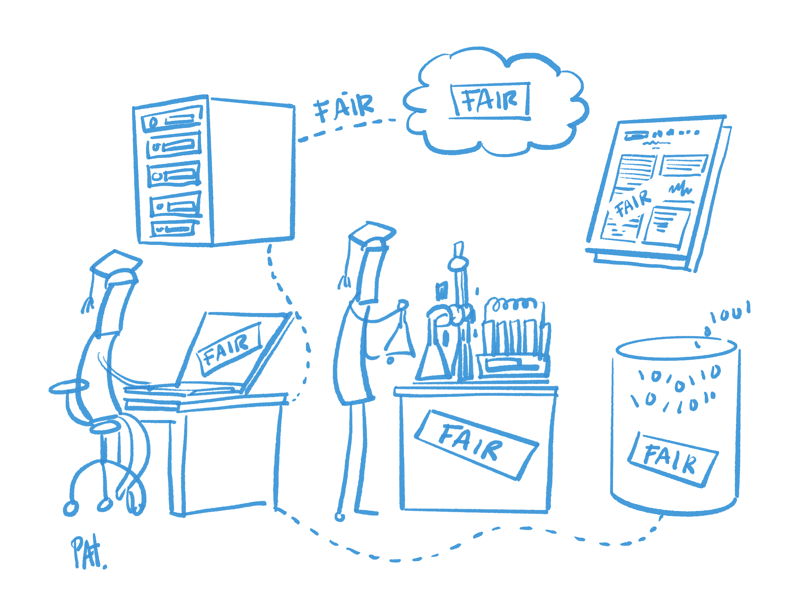

# 6. Implementing FAIR

## 6.1. Introduction

Researchers cannot be left alone to do the heavy lifting in data management according to FAIR principles; they need to rely on support services provided by their institutions. In view of this, this chapter shifts the perspective from the individual researcher or research projects to the institution: 

- How can they support their researchers with FAIR data management? 
- What support services are necessary, 
- What infrastructure needs to be put in place, and 
- What policies need to be enacted? 

Each section in this chapter links back to the lesson plans to connect this institutional overview with the details provided there.

It should be noted that this chapter focuses on the requirements and measures to be taken within an institution. FAIRness is a global and institutional goal. A large amount of research is done in cooperation with external parties. This should be reflected by incorporating respective elements in, e.g. policies or data sharing agreements, but covering such points extends far beyond the scope of this handbook.

---
